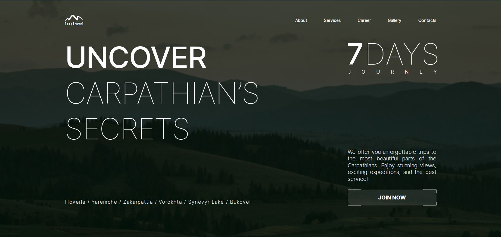

<h1 align="center">CarpTravel Website</h1>

<h2>About website</h2>

Landing page for the CarpTravel travel company that provides active recreation services in the Carpathians

<h2>Features</h2>
<ul>
  <li>
    <h3>Adaptive layout</h3>
    
Thanks to the adaptive layout, the site can adapt to different screen widths of devices such as smartphones, tablets or desktops

    
  </li>
   <li>
    <h3>Slider</h3>
    
Using the Swiper library, a slider was added to the "We offer" and "Our gallery" sections of the site. Using scrolling gestures and buttons, it makes it easy to scroll through gallery photos and service information text blocks, enhancing the overall user experience.

    
    
  </li>
   <li>
    <h3>Form validation</h3>
    
The site includes form validation using the React Hook Form library. This allows you to inform the user that he has not correctly entered the data in the form fields before sending.

    
  </li>
</ul>
